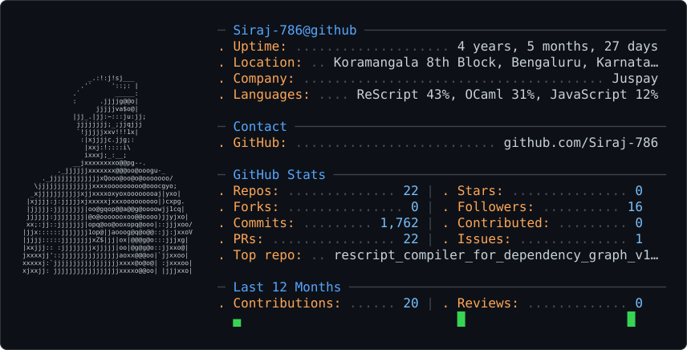

<picture>
  <source media="(prefers-color-scheme: dark)" srcset="dark_mode.svg" />
  <source media="(prefers-color-scheme: light)" srcset="light_mode.svg" />
  
</picture>

### Work at Juspay

Most of my work at Juspay lives in private Bitbucket repositories, so it doesn't show in the
GitHub stats above. Since March 2025: **100+ merged pull requests across 11 company repositories**.

My work GitHub account, [@sirajshaik-code](https://github.com/sirajshaik-code), covers the rest.
Its activity over the last year:

Profile card by <a href="https://github.com/crafter-station/gh-ascii">gh-ascii</a> · work graph by <a href="https://ghchart.rshah.org">ghchart</a>
